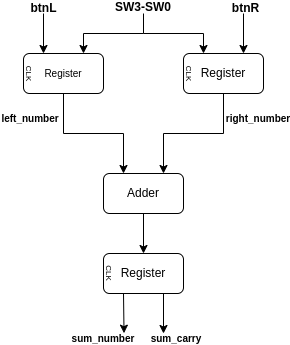
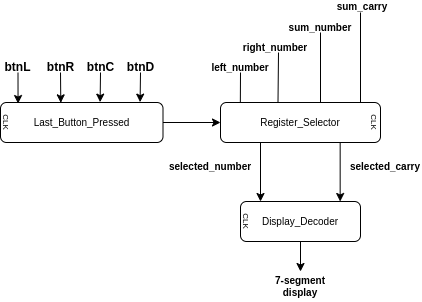

# __VHDL Projects__

These are two projects that I worked in [CKRE-110 Digital Logic and Hardware Architecture](https://continuing.torontomu.ca/search/publicCourseSearchDetails.do?method=load&courseId=26179), an introductory course in logic design, Boolean algebra and modelling in VHDL. 

The description language used for modelling the circuits is VHDL, which are then synthesized and implemented on the [Basys 3 Artix-7 FPGA](https://digilent.com/reference/programmable-logic/basys-3/start) development board.

## __Display Sum of Two Four-Bit Numbers__

The digital circuit described in the `sum_of_two_four_bit_numbers` folder reads two 4-bit numbers into memory and then displays the sum. Four switches, designated as `SW3`, `SW2`, `SW1` and `SW0`, are set by the user to specify a vector of binary digits representing a 4-bit number. Pressing the `btnL` button stores the current 4-bit vector to a memory register we call the `left_register`. The same logic applies when pressing the `btnR` button except the data is stored to a memory register we call the `right_register`. After inputting both numbers, pressing the `btnC` button displays the sum as a hexadecimal digit on the 7-segment display of the board. The `btnD` button clears all memory registers to zero. 

The diagrams below shows the different components of the four-bit adder circuit and how they connect to each other. In figure 1, the `left_register` and `right_register` outputs `left_number` and `right_number`, respectively. These internal signals are fed to the `Adder` component, which stores its result to a third register. This third register outputs the sum of the two operands as `sum_number` and `sum_carry`. 

|                                                                           |
| :----------------------------------------------------------------------------------------------------------------: |
| __Fig 1__. Store the two operands on the left and right registers and store the computed sum on the third register |

To display the content of the correct register base on the user's most recent button pressed, the `Last_Button_Pressed` component "remembers" the last button pressed. The output of this component is used by the `Register_Selector` to determine which number to send to the 7-segment display of the board.

|                                    |
| :-------------------------------------------------------------------------: |
| __Fig 2__. Remeber the last button pressed and choose the number to display |

Lastly, although not shown in the diagrams, the components are synchronized with a clock signal at 100 MHz and the four buttons `btnL`, `btnR`, `btnC`, and `btnD` are debounced.

## __Display a Counter Incrementing at 1 Hz__

The digital circuit described in the `counter_incrementing_at_1Hz` folder displays a counter on the 7-segment display that updates at a frequency of exactly `1 Hz`. That is, it displays the increments once per second. The counter counts from `0x0` to `0xF` then loops around.

The Basys3 comes with a single oscillator that provides a `100 MHz` clock signal. To achieve a frequency of 1 Hz from thsi clock signal, two internal counters were used. The first internal counter divides the 100 MHz by half seven times. This results to a frequency of `781250 Hz`, which corresponds to a period of `1.28e-6 s`. It takes exactly `390625` complete cycles of this signal for `0.5 s` to elapse. The second internal counter takes this signal produces a signal that alternate after every 390625 complete cycles. This results to an output signal with a period of `1.0 s`, which corresponds to a frequency of `1 Hz`.