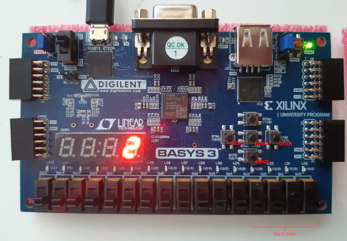

# __VHDL Projects__

These are two projects that I worked in [CKRE-110 Digital Logic and Hardware Architecture](https://continuing.torontomu.ca/search/publicCourseSearchDetails.do?method=load&courseId=26179), a course in logic design, Boolean algebra and modelling in VHDL. 

## __Four-Bit Adder__

## __1 Hz Incrementing Counter__

[Basys 3 Artix-7 FPGA](https://digilent.com/reference/programmable-logic/basys-3/start)

What was your motivation?
Why did you build this project?
What problem does it solve?
What did you learn?
What your application does,
Why you used the technologies you used,

